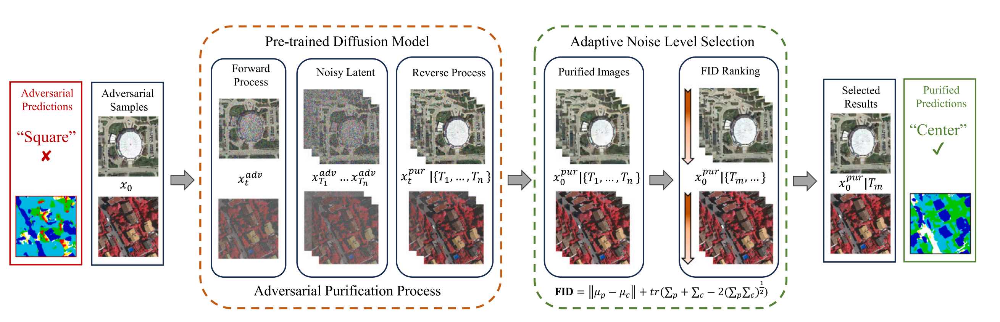

<div align="center">
<h1>UAD-RS </h1>
<h3>UAD-RS: Universal adversarial defense in remote sensing based on pre-trained denoising diffusion models</h3>

[Weikang Yu](https://ericyu97.github.io/)<sup>1,2</sup>, [Yonghao Xu](https://xkzhang.info/)<sup>3</sup>, [Pedram Ghamisi](https://www.ai4rs.com/)<sup>2,4</sup>

<sup>1</sup> Technical University of Munich, <sup>2</sup> Helmholtz-Zentrum Dresden-Rossendorf (HZDR), <sup>3</sup> Linköping University, <sup>4</sup> Lancaster University

Paper: [JAG 2024](https://www.sciencedirect.com/science/article/pii/S1569843224004850) (DOI: 10.1016/j.jag.2024.104131)
</div>


## Updates
``Oct 23, 2024`` The paper has been finally published, the codes and pretrained weights are released.
## Abstract
Deep neural networks (DNNs) have risen to prominence as key solutions in numerous AI applications for earth observation (AI4EO). However, their susceptibility to adversarial examples poses a critical challenge, compromising the reliability of AI4EO algorithms. This paper presents a novel Universal Adversarial Defense approach in Remote Sensing Imagery (UAD-RS), leveraging pre-trained diffusion models to protect DNNs against various adversarial examples exhibiting heterogeneous adversarial patterns. Specifically, a universal adversarial purification framework is developed utilizing pre-trained diffusion models to mitigate adversarial perturbations through the introduction of Gaussian noise and subsequent purification of the perturbations from adversarial examples. Additionally, an Adaptive Noise Level Selection (ANLS) mechanism is introduced to determine the optimal noise level for the purification framework with a task-guided Fréchet Inception Distance (FID) ranking strategy, thereby enhancing purification performance. Consequently, only a single pre-trained diffusion model is required for purifying various adversarial examples with heterogeneous adversarial patterns across each dataset, significantly reducing training efforts for multiple attack settings while maintaining high performance without prior knowledge of adversarial perturbations. Experimental results on four heterogeneous RS datasets, focusing on scene classification and semantic segmentation, demonstrate that UAD-RS outperforms state-of-the-art adversarial purification approaches, providing universal defense against seven commonly encountered adversarial perturbations.
## Model Structure
<p align="center">
  
</p>

## Highlights
* Introduces UAD-RS for universal adversarial defense on RS adversarial examples.
* Mitigates adversarial perturbations with unified pre-trained diffusion models.
* Implements an ANLS mechanism optimizing noise levels with FID ranking.
* Demonstrates effectiveness for scene classification and semantic segmentation.
* Outperforms SOTA approaches defending against seven adversarial perturbations.
## Getting started
### Environment Preparation
Create a conda environment for UAD-RS
 ```console
conda create -n UADRS
conda activate UADRS
conda install pytorch torchvision pytorch-cuda=12.1 -c pytorch -c nvidia
pip install diffusers
pip install accelerate==0.22.0
pip install datasets==2.19.0
pip install piqa
```
Configurate the accelerate package:
```console
accelerate config
```
___
### Pretraining Phase
Pretraining diffusion model is a process that adding Gaussian noise to the input by a certain diffusing step, and then reverse the process to denoise the noise latent to reconstruct a clean image. Here we will need to prepare a pretraining dataset first and then perform the pretraining process.
#### Pretraining Dataset Preparation
We will need to preprocess the datasets for pretraining foundation models. We would only need the oroginal images in the datasets as they serve both the inputs and referece of the diffusion model. You should download the datasets to your own environments, use the data preprocess tools ``utils/generate_pretraining_data.py``, and then organize the directory as follows:
```
├── <THE-ROOT-PATH-OF-DATA>/
│   ├── UCMerced_LandUse/     
|   |   ├── agricultural/
|   |   ├── airplane/
|   |   ├── ...
│   ├── AID/     
|   |   ├── Airport/
|   |   ├── BareLand/
|   |   |── ...
│   ├── Vaihingen/     
|   |   ├── top_mosaic_09cm_area1_0.png
|   |   ├── top_mosaic_09cm_area1_1.png
|   |   ├── ...
│   ├── Zurich/    
|   |   ├── zh1_0.png
|   |   ├── zh1_1.png
|   |   ├── ...
```
#### Pretraining Diffusion Models
Here are some scripts for pretraining foundation models, please adapt the script based on your own requirements.
```console
accelerate launch train_unconditional.py --train_data_dir /home/yu34/datasets/Vaihingen_Diffusion --resolution=256 --random_flip --output_dir="ddpm-ema-Vaihingen-256-1ksteps-overlap200" --ddpm_num_steps 1000 --ddpm_num_inference_steps 1000 --train_batch_size=16 --num_epochs=1000 --gradient_accumulation_steps=1 --use_ema --learning_rate=1e-4 --lr_warmup_steps=500 --mixed_precision=fp16

accelerate launch train_unconditional.py --train_data_dir /home/yu34/datasets/Zurich_Diffusion --resolution=256 --random_flip --output_dir="ddpm-ema-Zurich-256-1ksteps-overlap100" --ddpm_num_steps 1000 --ddpm_num_inference_steps 1000 --train_batch_size=16 --num_epochs=1000 --gradient_accumulation_steps=1 --use_ema --learning_rate=1e-4 --lr_warmup_steps=500 --mixed_precision=fp16

accelerate launch train_unconditional.py --train_data_dir /home/yu34/datasets/UCM_FULL --resolution=256 --center_crop --random_flip --output_dir="ddpm-ema-UCM-256-1k-800steps" --ddpm_num_steps 800 --ddpm_num_inference_steps 800 --train_batch_size=16 --num_epochs=1000 --gradient_accumulation_steps=1 --use_ema --learning_rate=1e-4 --lr_warmup_steps=500 --mixed_precision=fp16

accelerate launch train_unconditional.py --train_data_dir /home/yu34/datasets/AID_256 --ddpm_num_steps 1200 --ddpm_num_inference_steps 1200 --resolution=256 --center_crop --random_flip --output_dir="ddpm-ema-AID-256-1k-1200steps" --train_batch_size=16 --num_epochs=1000 --gradient_accumulation_steps=1 --use_ema --learning_rate=1e-4 --lr_warmup_steps=500 --mixed_precision=fp16
```

#### Pretrained Model Weights Available!
```ericyu/ddpm-ema-Vaihingen-256-1k-overlap200```

```ericyu/ddpm-ema-Zurich-256-1k-overlap100```

```ericyu/ddpm-ema-UCM-256-1k```

```ericyu/ddpm-ema-AID-256-1k```
#### Image Generation Test
We provide a simple script for image synthesis as stated in the paper, you can find it in ```image_generation_test.py```. Please revise the code to specify the pretrained diffusion model you want to use.

---
### Crafting Adversarial Examples (UAE-RS)
We use [UAE-RS](https://github.com/YonghaoXu/UAE-RS/tree/main) repo to craft the adversarial examples that will be used in our experiments, please follow the instructures in that repo to first train the classifiers and then generate adversarial examples.

The pretrained model should be stored like this:
```
├── <THE-ROOT-PATH-OF-UAE-RS>/
│   ├── AID/
|   |   ├── Pretrain/
|   |   |   ├── alexnet
|   |   |   ├── densenet121
|   |   |   ├── regnet400_x_400mf
|   |   |   ├── resnet18
│   ├── UCM/
|   |   ├── Pretrain/
|   |   |   ├── alexnet
|   |   |   ├── densenet121
|   |   |   ├── regnet400_x_400mf
|   |   |   ├── resnet18
│   ├── segmentation/
│   |   ├── Vaihingen/
|   |   |   ├── Pretrain/
|   |   |   |   ├── fcn8s
|   |   |   |   ├── linknet
|   |   |   |   ├── pspnet
|   |   |   |   ├── unet
│   |   ├── Zurich/
|   |   |   ├── Pretrain/
|   |   |   |   ├── fcn8s
|   |   |   |   ├── linknet
|   |   |   |   ├── pspnet
|   |   |   |   ├── unet
```

The crafted adversarial examples should be stored like this:
```
├── <THE-ROOT-PATH-OF-UAE-RS>/
│   ├── AID_adv/     
|   |   ├── cw/
|   |   |   ├── alexnet/
|   |   |   ├── ...
│   ├── UCM_adv/     
|   |   ├── cw/
|   |   |   ├── alexnet/
|   |   |   ├── ...
│   ├── segmentation/
│   |   ├── Vaihingen_adv/     
|   |   |   ├── cw
|   |   |   |   ├── fcn8s
|   |   |   |   ├── ...
│   |   ├── Zurich_adv/     
|   |   |   ├── cw
|   |   |   |   ├── fcn8s
|   |   |   |   ├── ...
```
---
### Adversarial Purification (UAD-RS)
We will use ```purify.py``` for adversarial purification, and ```ansl.py``` for adaptive noise level selection.
#### Step1: Purify the adversarial examples with different noise levels
Revise the ```purify.py``` to meet your requirements and run:
```console
python purify.py -input_path $your_path_of_adversarial_examples -pretrained_path $your_path_of_pretrained_DDPM --save_path $ your_path_for_results_saving -phase 0
```
It will scan the noise level from 10 to 150 and generate several purified samples.

#### Step2: Perform ANLS on the purified samples to find the best noise level
Setup all the parameters in anls.py and run:
```console
python anls.py -dataset $dataset_name -root_path $UAE-RS path -model $model_used -clean_path $path_of_training_data -adv_path $path_of_adversarial_exmaples
```
#### Step3: Purify all the adversarial examples with the optimal noise level obtained from ANLS
Revise the ```purify.py``` to meet your requirements and run:
```console
python purify.py -input_path $your_path_of_adversarial_examples -pretrained_path $your_path_of_pretrained_DDPM -save_path $ your_path_for_results_saving -phase 1 -noise_level $optimal_noise_level_obtained
```

If you find UAD-RS useful for your study, please kindly cite us:
```
@article{yu2024universal,
  title={Universal adversarial defense in remote sensing based on pre-trained denoising diffusion models},
  author={Yu, Weikang and Xu, Yonghao and Ghamisi, Pedram},
  journal={International Journal of Applied Earth Observation and Geoinformation},
  volume={133},
  pages={104131},
  year={2024},
  publisher={Elsevier}
}
```

# Acknowledgement

The codes are largely built based on the diffusers.